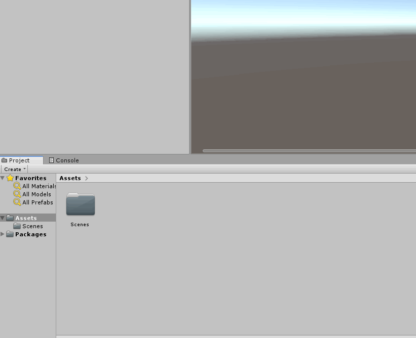
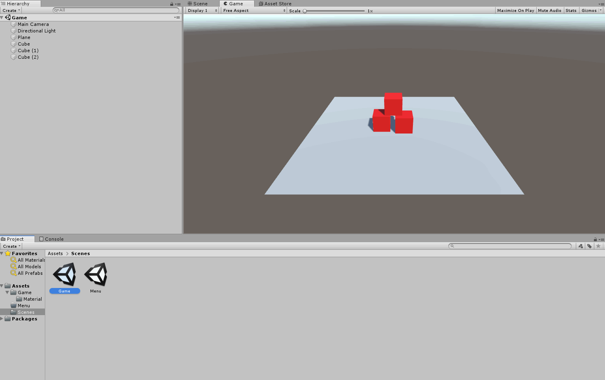
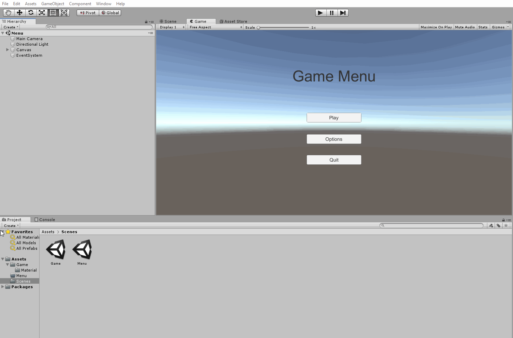
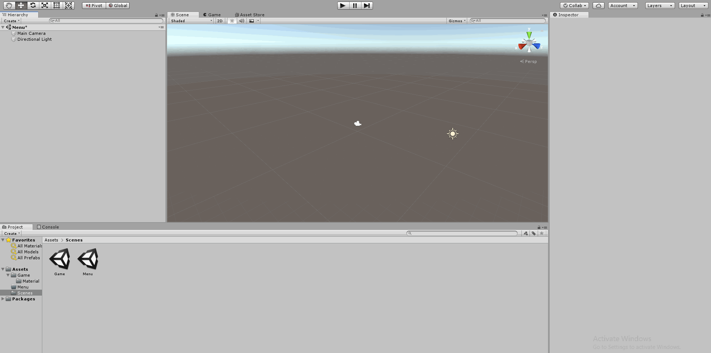
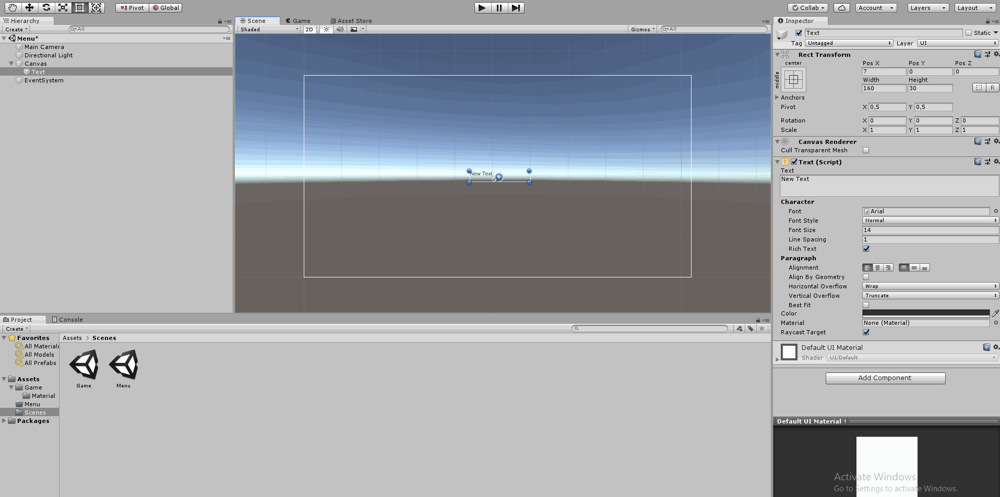
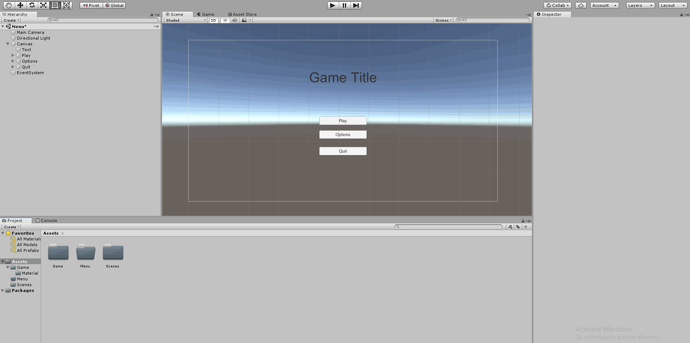
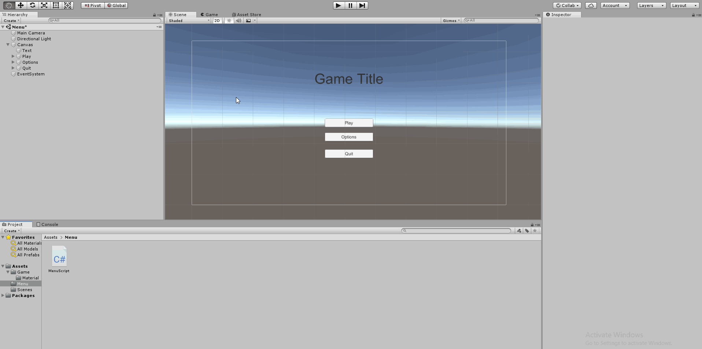

# Game menu
Menuen er det første vi ser når vi starter et spil. I stedet for at blive smidt direkte ind i spillet er en menu en god måde at give spilleren mulighed til at gøre sig parat til at spille og justere i indstillinger som lyd og grafik. Vi vil i dette afsnit lave en meget simpel menu, og udvide den senere med flot grafik, animationer, musik og avancerede funktioner.

## Introduktion til **Scenes** og **Scenemanagement**
I Unity kan vi bruge scener til at opdele vores spil i mindre dele. I dette tilfælde skal vi bruge en scene til at vise vores menu, og en anden scene til vores spil. Længere ind i projektet kan vi bruge flere scener til at lave flere levels til vores spil. Fordelen ved at opdele spillet i scener i stedet for at have det hele samlet et sted er hastighed, mange små scener vil køre hurtigt på vores computere, modsat en kæmpe scene som indeholder alt.



Vi starter ud med at lave to nye scener, henholdsvis *Game* og *Menu*. Vi kan skifte imellem dem som vi har lyst, men bemærk når vi laver en ændring i scenen er det vigtigt at vi gemmer. **CTRL + S** er vores vigtigste redskab. Hvis man ikke gemmer sin scene vil alt ens arbejdet i scenen være forsvundet.



Når begge scener er lavet skal vi fortælle Unity hvilket **Index** hver scene har. Dette foregår i **Build Settings** hvor vi drag-n-drop hver scene ind i feltet "Scenes in Build". Den første scene vil have index 0, den næste 1, 2, osv. Når spillet starter vil Unity automatisk åbne den første scene med index 0. Det er derfor en god ide at have menuen som den første scene.



## Menu: Canvas
Når begge scener er lavet kan vi åbne *Menu* scenen og gå igang med vores menu. I unity foregår alting 2-Dimensionelt som billeder på et **Canvas**. Vi har intet canvas lige nu, men hvis vi går til *Create->UI->Text* vil et canvas automatisk dukke op som er konfigureret til vores skærm, med noget text på.
Canvasset er meget stort lige nu, og alt efter hvordan vores kamera er orienteret kan det være svært at se det ordentligt. Derfor skal vi skifte til 2-Dimensionelt view, og zoome en del ud. Herefter er vi klar til at lave en simpel menu.



Selve designet af menuen er op til jer. I dette tilfælde laver vi en titel tekst og tre knapper *play*, *options* og *quit*. Hvis i er interesserede i et bedre design kan i se .



## Funktionalitet
Vi har en fin menu, men den gør ikke noget endnu. Vi skal nu lave vores første C# script. Vi benytter os af SceneManager, og laver to funktioner *play* og *quit*. Vi kommer til at refere til disse funktioner i vores knapper, så det er vigtigt at de er **Public**, dvs. Synlige udenfor scriptet.



```C#
using System.Collections;
using System.Collections.Generic;
using UnityEngine;
using UnityEngine.SceneManagement; // Vi skal bruge SceneManager i dette script.

public class MenuScript : MonoBehaviour
{
   	// Funktion starter vores spil; Sætter nuværende scene index til = Nuværende index + 1.
	public void Play()
	{
		SceneManager.LoadScene(SceneManager.GetActiveScene().buildIndex + 1); // Vi loader scene med index (Nuværende + 1)
	}	

	// Funktion lukker vores spil; Virker ikke i Unity Editor, Først når vi compiler vores spil.
	public void Quit()
	{
		Debug.Log("Quit!"); // Skriv "Quit!" i konsol.
		Application.Quit(); // Luk Spil.
	}

}
```

For at benytte funktionerne kommer vi til at refere til dem via **OnClick** events, som er indbygget i vores knapper. Hvis vi vælger en knap og ser i inspektions vinduet kan vi se et felt kaldet **On Click ()**. Det er her vi beder Unity om at kalde en specifik funktion når knappen bliver trykket.

Selve C# scriptet lægger vi som en komponent på Canvas, og ved at refere til Canvas i vores onClick event kan vi nu se at vores funktion *Play()* burde poppe op. Hvis den ikke gør er der oftest en syntaks fejl i koden som gør at Unity ikke opdaterer scriptet.



Det var alt for en simpel Menu. Vi kan nu gå videre til at lave vores spil, eller bruge lidt mere tid på at forfine vores Menu med bedre grafik, musik, indstillinger eller nogle fede animationer.

## Extra
### Grafik
### Musik
### Indstillinger
### Animationer

## Back


