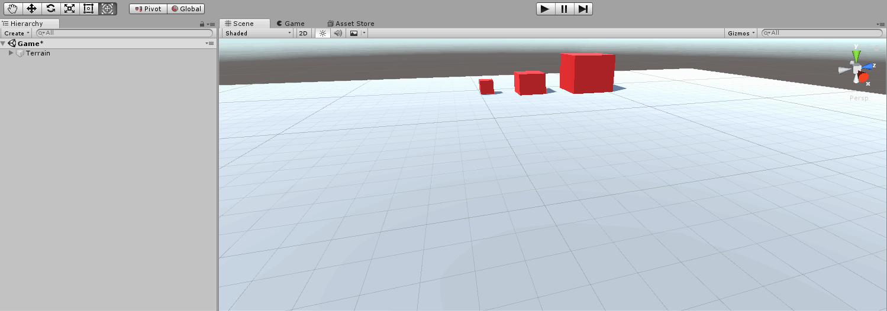

# Player controller
Der er intet spil uden en form for character som vi kan spille. En god character kan lave et simpelt spil fantastisk, en dårlig en kan ødelægge selv det bedste spil. Der er utalige mange måder at lave en FPS character på, og alle har sine fordele og ulemper. Vi kunne nøjes med at tage en tilfældig en fra standard assets eller asset store, men disse er oftest meget komplicerede og svære at ændre uden meget forhåndsviden.

Vi vil gennemgå en meget simpel character controller, som er nem at justere til ethvert behov. Start ud med at vælge en model som spiller og læg en Rigidbody til modellen.



## Introduktion til Rigidbody bevægelse
Til at bevæge os i 3-dimensioner skal vi bruge lidt fysik. I Unity skal enhver model bruge en "Rigidbody" hvis de skal inkluderes i Unity's physics engine. Dette betyder enhver model med Rigidbody bliver trukket ned af tyngdekraften, kan blive skubbet rundt af andre objekter og bevæges igennem et script.


For at begynde skal vi altid have en reference til det objekt vi vil manipulere. I dette tilfælde en reference til typen __Rigidbody__.
```C#
public Rigidbody rb; // Reference til modellens Rigidbody
```
Herefter skal vi vælge en retning som vi vil bevæge os i. Vi befinder os i 3 Dimensioner, så en retning kan beskrives som 3 tal (X,Y,Z).
```C#
public float X = 0f; // X Komposant
public float Y = 0f; // Y Komposant
public float Z = 0f; // Z Komposant
```
Vi kender retningen, men vi ved ikke hvor hurtigt vi skal bevæge os. Vi skal bruge endnu en værdi: Hastighed.
```C#
public float moveSpeed = 1f; // Bevægelses konstant
```
Vi har alt vi skal bruge for at bevæge vores model, nu skal vi bare gøre det! Normalt udføres kode i _void Update()_, som kaldes ved hver frame opdatering. Dette er typisk ikke et problem, indtil vi bevæger os 1 meter hver gang vi kalder _Update()_ funktionen. Hvis vi har en computer med en framerate på 120 frames per sekund vil vi bevæge os 120 meter i sekundet. En computer med 60 fps vil dog kun bevæge sig ved 60 meter i sekundet.

Dette er en stor forskel for hvad burde være den samme spiller! Vi benytter i stedet _FixedUpdate()_, som er uafhængig af framerate. Nu vil begge 
spillere bevæge sig ved en konstant værdi.
```C#
void FixedUpdate()
{
	// Bevægelse
}
```
For at bevæge os skal vi først samle vores 3 værdier X, Y og Z til at danne en vektor _new Vector3(X,Y,Z)_. Vektoren er hvad der egentligt peger i retningen vi vil have i Unity. 
```C#
void FixedUpdate()
{
	new Vector3(X,Y,Z);
}
```

Længden af vektoren er vores hastighed, for at sikre os at vi bevæger os ved en god hastighed ganger vi den med vores hastighedskonstant.
```C#
void FixedUpdate()
{
	new Vector3(X,Y,Z) * moveSpeed;
}
```
Denne værdi lægges til som vores Rigidbodys hastighed.
```C#
void FixedUpdate()
{
	rb.velocity += new Vector3(X,Y,Z) * moveSpeed;
}
```
Vi kan nu bevæge vores model i alle retninger. Dette er ikke en reel måde at spille på, men fundamentalt er dette hvordan vi bevæger vores spiller.
```C#
public Rigidbody rb; // Reference til modellens Rigidbody

// Komposanter (dele) af de 3 Dimensioner (X,Y,Z).
[Range(-1f,1f)] public float X = 0f; // X Komposant
[Range(-1f,1f)] public float Y = 0f; // Y Komposant
[Range(-1f,1f)] public float Z = 0f; // Z Komposant
// Tilsammen danner disse 3 værdier en retning i 3-dimensioner.

[Range(-5f,5f)] public float moveSpeed = 1f; // Bevægelses konstant

void FixedUpdate() // Alt fysik skal opdateres i FixedUpdate, så det er uafhængig af framerate.
{
	// Lav vores retning og gang med vores hastighed og læg den til vores Rigidbody hastighed.
	rb.velocity += (new Vector3(X,Y,Z) * moveSpeed); 
}
```
Bemærk at værdierne er nu erstattet med slidere fra (-1, 1) og (-5, 5) ved brug af __[Range(x,y)]__ foran værdien.
## Bevægelse med WASD.
Vi vil gerne bevæge os mere intuitivt med WASD knapperne. Dette kan vi gøre nemt med Unitys indbyggede __Input__ funktioner. Vi skal forestille os at knapperne W & S tilsammen danner en værdi. Hvis man holder W nede vil værdien være 1, hvis man holder S nede vil værdien være -1. Hvis begge eller ingen knap holdes nede vil værdien være nul.
```C#
Input.GetAxis("Vertical");  // W & S Akse
Input.GetAxis("Horizontal") // A & D Akse
```
Vi vil gerne benytte W & S til at bevæge fremad. For at kunne bevæge fremad skal vi først vide hvad er fremad? Ved at refere til vores models Transform kan vi altid vide hvad er modellens "fremad". Vi kan erstatte vores (X,Y,Z) komposanter fra vores forrige script med denne vektor.

Det samme kan gøres for A & D og spillerens side. Vi ganger hastigheden på disse vektorer og lægger dem sammen til den samlede hastighed.
```C#
public Rigidbody rb; // Reference til modellens Rigidbody
public Transform player; // Reference til modellens position

[Range(-5f,5f)] public float moveSpeed = 1f; // Bevægelses konstant

void FixedUpdate() // Alt fysik skal opdateres i FixedUpdate, så det er uafhængig af framerate.
{
	Vector3 WSMove = Input.GetAxis("Vertical") * moveSpeed * player.forward; // W & S * Hastighed * Fremad
	Vector3 ADMove = Input.GetAxis("Horizontal") * moveSpeed * player.right; // A & D * Hastighed * Side

	rb.velocity += WSMove + ADMove; // Læg begge hastighed til vores nuværende hastighed.
}
```

Vi kan nu bevæge os! Men vores spiller opfører sig underligt. Vi er ikke interesserede i at vores spiller roterer rundt, så vi låser alle rotations akser.

## First Person Camera
Vi kan bevæge os, men dette er ikke et første person spil indtil vi faktisk har et første person kamera. Vi sletter det globale kamera og danner et nyt under vores spiller. Vi danner et nyt script kaldet "CameraLook" og indsætter koden nedenunder. Koden vil låse musen i spillet, og roterer spilleren baseret på musen således at "fremad" altid er hvor kameraet kigger.


```C#
using System.Collections;
using System.Collections.Generic;
using UnityEngine;

public class CameraLook : MonoBehaviour
{
	 public Transform playerBody;			// Reference til spillerens Transform
     public float mouseSensitivity = 0.5f;	// Musfølsomhed
     float xAxisClamp;						// X Akse værdi: Stopper spilleren fra at rotere hovedet rundt om fødderne og op.

    void Awake() // Når spilleren starter; Lås musen til kamera.
    {
        Cursor.lockState = CursorLockMode.Locked;
    }

    void Update() // Opdater rotation på kamera og spiller hver frame.
    {
        RotateCamera();
    }

    void RotateCamera()
    {
    	// Hent musens position
        float MouseX = Input.GetAxis("Mouse X");	
        float MouseY = Input.GetAxis("Mouse Y");
 
 		// Udregn rotations værdier udfra musens position og følsomhed
        float rotAmountX = MouseX * mouseSensitivity;
        float rotAmountY = MouseY * mouseSensitivity;
 
 		// Opdater vores x akse (Så vi ikke roterer for meget)
        xAxisClamp -= rotAmountY;
 
 		// Hent nuværende rotation af camera og spiller
        Vector3 targetRotCam = transform.rotation.eulerAngles;
        Vector3 targetRotBody = playerBody.rotation.eulerAngles;
 
 		// Roter spillerens krop og kamera
        targetRotCam.x -= rotAmountY;
        targetRotCam.z = 0;
        targetRotBody.y += rotAmountX;
 
 		// Hvis spilleren ser for meget ned eller op; Lås kamera til en fast vinkel.
        if (xAxisClamp > 90)
        {
            xAxisClamp = 90;
            targetRotCam.x = 90;
        }
        else if (xAxisClamp < -90)
        {
            xAxisClamp = -90;
            targetRotCam.x = 270;
        }
 
 		// Udfør rotationen.
        transform.rotation = Quaternion.Euler(targetRotCam);
        playerBody.rotation = Quaternion.Euler(targetRotBody);
    }

}
```

## Jump
```C#
using System.Collections;
using System.Collections.Generic;
using UnityEngine;

public class PlayerMovement : MonoBehaviour
{

	public RigidBody rb;		// Spillerens Rigidbody
	public Transform player;	// Spillerens Transform

	public float moveSpeed = 1.0f;	// Hastigheds konstant
	public float jumpForce = 2f;	// Kraft i hop
    public float jumpHeight = 2f;	// Længde før vi ikke kan hoppe længere

	// Til RigidBody bruger vi FixedUpdate() i stedet for Update()
	void FixedUpdate(){

		// Bevægelse med W og S.
		// VerticalMovement = (W = 1 eller S = -1) * Hastigheds Konstant * Spillerens front.
		Vector3 VerticalMovement = Input.GetAxis("Vertical") * moveSpeed * player.forward;
		Vector3 HorizontalMovement = Input.GetAxis("Horizontal") * moveSpeed * player.right;

		// Vi lægger vores hastighedsvektor til spillerens nuværende hastighed.
		rb.velocity += VerticalMovement + HorizontalMovement;

		// Hop mechanic: Hvis "Jump" knappen trykkes og vi er tæt ved jorden; Så.
        if(Input.GetButton("Jump") && isGrounded()){
            // Læg endnu en kraft til vores spiler opad.
            rb.AddForce(new Vector3(0,jumpForce,0), ForceMode.Impulse);
        }
	}

	bool isGrounded(){
        // Tegn en linje fra spillerens position ned en given længde: Hvis vi rører noget kan vi hoppe.
        return Physics.Raycast(player.position, Vector3.down, jumpHeight);
    }
}
```


## Anderledes hastighed i luft

```C#
using System.Collections;
using System.Collections.Generic;
using UnityEngine;

public class PlayerMovement : MonoBehaviour
{

	public RigidBody rb;		// Spillerens Rigidbody
	public Transform player;	// Spillerens Transform

	public float moveSpeed = 1.0f;	// Hastigheds konstant
	public float jumpForce = 2f;	// Kraft i hop
    public float jumpHeight = 2f;	// Længde før vi ikke kan hoppe længere

	// Til RigidBody bruger vi FixedUpdate() i stedet for Update()
	void FixedUpdate(){

		if(isGrounded()){
            // Bevægelse med W og S.
			// VerticalMovement = (W = 1 eller S = -1) * Hastigheds Konstant * Spillerens front.
			Vector3 VerticalMovement = Input.GetAxis("Vertical") * moveSpeed * player.forward;
			Vector3 HorizontalMovement = Input.GetAxis("Horizontal") * moveSpeed * player.right;

			// Vi lægger vores hastighedsvektor til spillerens nuværende hastighed.
			rb.velocity += VerticalMovement + HorizontalMovement;

			// Hop mechanic: Hvis "Jump" knappen trykkes og vi er tæt ved jorden; Så.
        	if(Input.GetButton("Jump")){
            	// Læg endnu en kraft til vores spiler opad.
            	rb.AddForce(new Vector3(0,jumpForce,0), ForceMode.Impulse);
        	}
        }
        else{
            // Bevægelse med W og S.
			// VerticalMovement = (W = 1 eller S = -1) * Hastigheds Konstant / 4 * Spillerens front.
			Vector3 VerticalMovement = Input.GetAxis("Vertical") * moveSpeed/4 * player.forward;
			Vector3 HorizontalMovement = Input.GetAxis("Horizontal") * moveSpeed/4 * player.right;

			// Vi lægger vores hastighedsvektor til spillerens nuværende hastighed.
			rb.velocity += VerticalMovement + HorizontalMovement;
        }
	}

	bool isGrounded(){
        // Tegn en linje fra spillerens position ned en given længde: Hvis vi rører noget kan vi hoppe.
        return Physics.Raycast(player.position, Vector3.down, jumpHeight);
    }
}
```

## Max hastighed

```C#
using System.Collections;
using System.Collections.Generic;
using UnityEngine;

public class PlayerMovement : MonoBehaviour
{

	public RigidBody rb;		// Spillerens Rigidbody
	public Transform player;	// Spillerens Transform

	public float moveSpeed = 1.0f;	// Hastigheds konstant
	public float maxSpeed = 10.0f;	// Maximum hastighed
	public float jumpForce = 2f;	// Kraft i hop
    public float jumpHeight = 2f;	// Længde før vi ikke kan hoppe længere


	// Til RigidBody bruger vi FixedUpdate() i stedet for Update()
	void FixedUpdate(){
		// Hvis vi rør jorden; Bevæg som normalt.
		if(isGrounded()){
            // Bevægelse med W og S.
			// VerticalMovement = (W = 1 eller S = -1) * Hastigheds Konstant * Spillerens front.
			Vector3 VerticalMovement = Input.GetAxis("Vertical") * moveSpeed * player.forward;
			Vector3 HorizontalMovement = Input.GetAxis("Horizontal") * moveSpeed * player.right;

			// Vi lægger vores hastighedsvektor til spillerens nuværende hastighed.
			rb.velocity += VerticalMovement + HorizontalMovement;

			// Hop mechanic: Hvis "Jump" knappen trykkes og vi er tæt ved jorden; Så.
        	if(Input.GetButton("Jump")){
            	// Læg endnu en kraft til vores spiler opad.
            	rb.AddForce(new Vector3(0,jumpForce,0), ForceMode.Impulse);
        	}
        }
        else{ // Hvis vi ikke rør jorden; Bevæg os med lavere hastighed og intet hop.
            // Bevægelse med W og S.
			// VerticalMovement = (W = 1 eller S = -1) * Hastigheds Konstant / 4 * Spillerens front.
			Vector3 VerticalMovement = Input.GetAxis("Vertical") * moveSpeed/4 * player.forward;
			Vector3 HorizontalMovement = Input.GetAxis("Horizontal") * moveSpeed/4 * player.right;

			// Vi lægger vores hastighedsvektor til spillerens nuværende hastighed.
			rb.velocity += VerticalMovement + HorizontalMovement;
        }

        // Hvis vores hastighed er større end maxSpeed; Sæt hastighden til maxSpeed.
        if(rb.velocity.magnitude > maxSpeed){
            rb.velocity = rb.velocity.normalized * maxSpeed;
        }
	}

	bool isGrounded(){
        // Tegn en linje fra spillerens position ned en given længde: Hvis vi rører noget kan vi hoppe.
        return Physics.Raycast(player.position, Vector3.down, jumpHeight);
    }
}
```