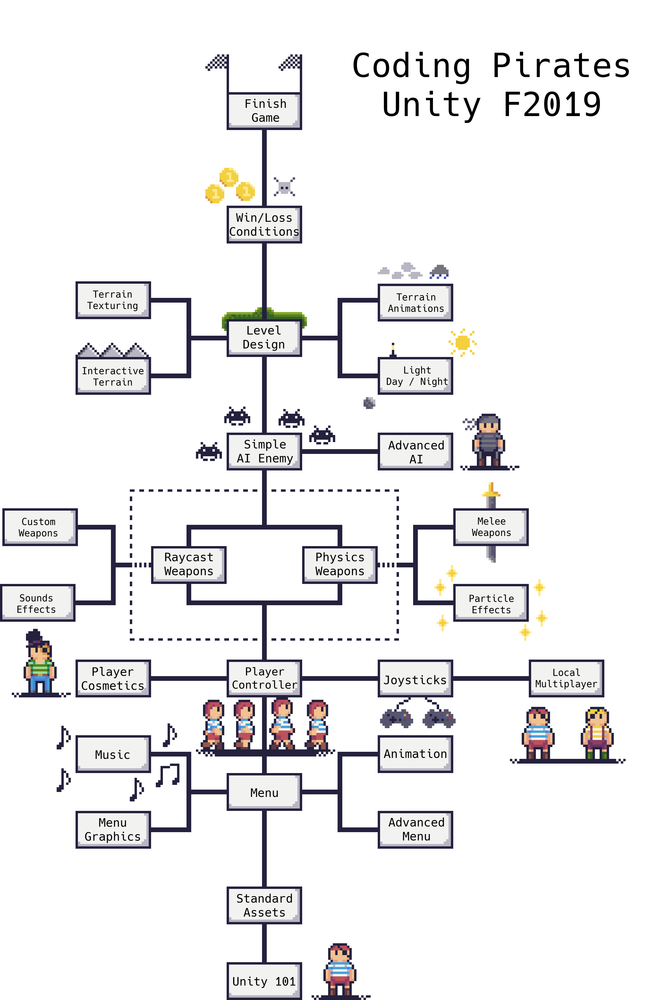

# Coding Pirates - Unity Hold 2019 Forår
Dette repo er undervisningsmateriale til Coding Pirates Unity hold 2019 forår. Målet for denne sæson er at lave en simpel first person shooter med en række muligheder til at videreudvikle emner man finder interessante.

## Roadmap
Nedenfor ses undervisningsforløbet visuelt. Ideen er at vi starter fra bunden af og bygger os op til et færdigt spil. Hvis man er interesseret i at blive hurtigt færdig går man op af hvert felt i midten indtil man er parat til at uploade sit spil til [itch.io](https://www.itch.io).

Udfra midten er der en masse underemner som kan give ens spil mere indhold, samt give indblik i en række andre værktøj som [3D-Modelering](https://www.blender.org), [Musik](https://boscaceoil.net/) og en del andre. Sværhedsgraden er op til den enkelte, hvert emne vil starte ud simpelt og introducere sværere emner løbene. Når man har opnået det man vil, eller ikke kan følge med mere kan man altid gå videre til et andet emne og komme tilbage på et andet tidspunkt

Vær opmærksom på at intet i undervisningsforløbet er fast. Vi opdaterer alting løbende alt efter om et emne er for svært, for let eller om der kommer gode ideer til nye emner.

## Index
### [Menu](Menu/menu.md)
#### [Advanced Menu](Menu/Advanced/advanced.md)
#### [Animation](Menu/Anomation/animation.md)
#### [Menu Graphics](Menu/Graphics/graphics.md)
#### [Music](Menu/Music/music.md)
### [Player](Player/control.md)
#### [Cosmetics](Player/Cosmetics/cosmetics.md)
#### [Controller Inputs](Player/Joysticks/joystick.md)
##### [Local Multiplayer](Player/Joysticks/Multiplayer/multiplayer.md)
### [Weapons](Weapons/weapon.md)